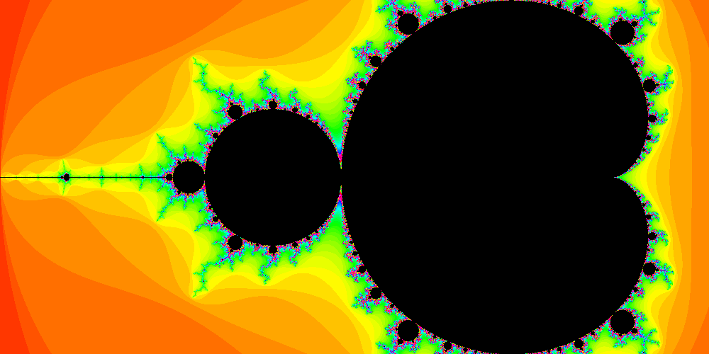

# mandelbrot

Generates colored .png series of Mandelbrot set zooms

### Example

```shell
go run mandelbrot -iw 1000 -ih 500 -x -0.7 -s 2.6 -i 10000
```

Produces the following output:  


### Usage

```
  -h    print this message
  -i iterations
        *number of iterations during computation
  -ih pixels
        *image height in pixels (Y)
  -iw pixels
        *image width in pixels (X)
  -p    enable CPU and memory profiling
  -r images
        number of consecutive output images (default 1)
  -s span
        *X/Re span of the image
  -v    print additional information during execution
  -x float
        center of image (X/Re)
  -y float
        center of image (Y/Im)
  -z factor
        scaling factor of each consecutive image if -r>1 (0.8=80%) (default 0.9)
  * - mandatory values
```
